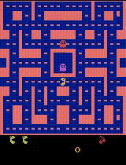

# Reinforcement Learning for MsPacman-v5

This repository implements reinforcement learning agents for the Atari game **MsPacman-v5**, using PyTorch.  
The goal is to train agents that can learn effective strategies for surviving and scoring in the game environment.

The current implementation supports three algorithms: **DQN, DDQN, and Dueling DQN**, and more details (including training pipeline and evaluation results) will be added soon.

# Problem Description
The MsPacman-v5 environment is a challenging benchmark in the Atari suite.  
The agent must learn to navigate the maze, collect pellets, and avoid ghosts, which requires balancing **exploration** and **exploitation** in a dynamic environment.

I focus on three progressively stronger reinforcement learning algorithms:

- **DQN**: A Deep Q-Network that approximates the Q-function with a CNN.
- **DDQN**: Double DQN to reduce Q-value overestimation.
- **Dueling DQN**: Separates state-value and action-advantage estimation to improve learning efficiency.

An example of trained agent gameplay is shown below:

## Features
- PyTorch-based DQN, DDQN, and Dueling DQN implementations

Stay tuned for updates!
